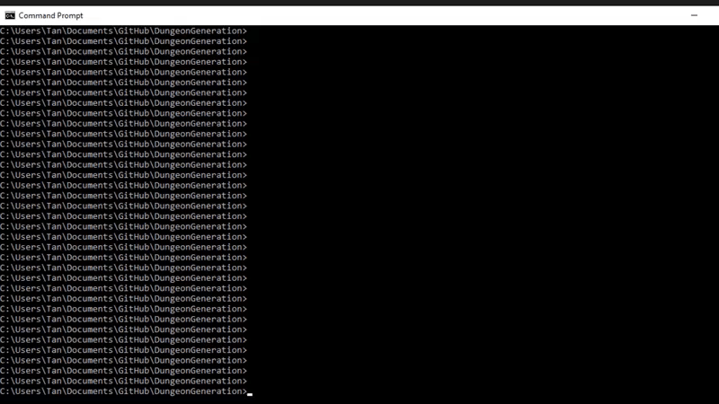
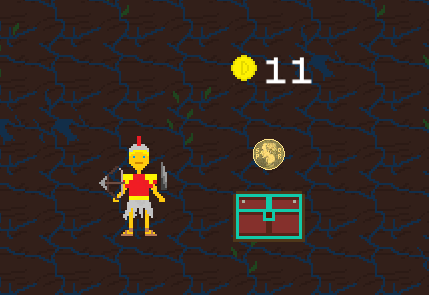

# <b>Videogame Group Project</b>

A group video game project built for 2nd Year Comp Sci @ Lancaster Uni.

## Build & Use

### Linux
Run `buildme.sh` to build the project, and run the program by running `runme.sh`.

### Windows
Run `buildme.bat` to build the project, and run the program by running `runme.bat`.

## Images
  
### Stress test scenario.

### Multi-agent Drunkard's Walk dungeon generation algorithm.

### A shop selling an item for 11 coins.

